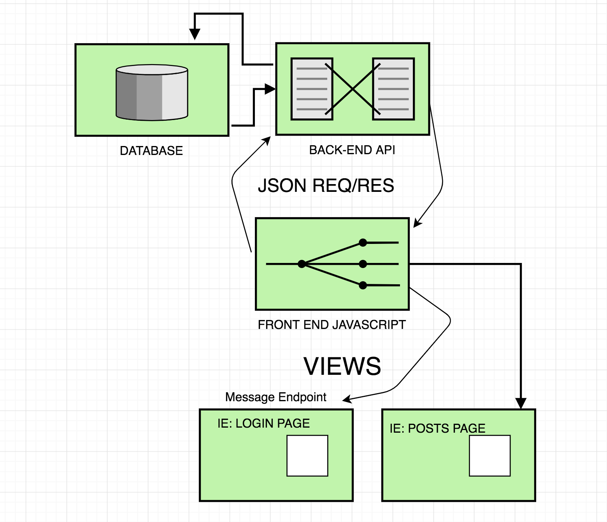

#  Report #2 : **Back-end Weekly Checkpoint #2**

# **Back-end Weekly Checkpoint #1**

**(Q1)*What has your team accomplished in the past week?***

- Made a JSON-based non-live DB connected CRUD API
- Connected our API to the Database with limited functionality

**(Q2)*Did your team encounter unexpected hurdles? How will your team work through any hurdle**?* 

- We've encountered many hurtles including ones in general python-functionality, communication, work allocation and cross-group architectural understanding.
    - Python has thrown us many new extensions to learn and try. With all the options and different ways of doing so, it's been a hard thing to be able to understand which ones to use when.
    - Work allocation has been difficult, our group has varying experience working on a back-end system, and the current file system of the whole project and back end project is somewhat confusing
        - **Solution: (A)**Spend class time for all group's to come to a common understanding of the file system.
            - (B) Set class time for groups to review their portion of the repository

**(*Q3)What tools worked, what didn’t?***

**What worked:**

- Parsing the Databases responses into JSON strings then python objects(dicts) that are easy to manipulate and send back to the front end!

**What didnt:**

- When working on the CRUD API, mysqldb didn't work on most systems.
    - Setting up a server on campus or a rasbperry pi (for now)
- Testing the front end hitting the backend
    - This works on its own, given a javascript file that calls the API using a fetch(), however we have yet to see a frontend implementation/testing the API

**(Q4)***:*Discuss with your team as a group what should be tackled for the upcoming week. Will there be any shifts or changes in the features your team will be working on? Will scheduling be affected? Are you waiting on another team for any features to finish?

### In the coming week we're working on tackling

- Getting api calls from the front end's javascript, preferably sending the API/us JSON with identifiable information as to what should happen when.
- Establishing a strategy of who/how authentication will happen, will the front end be handling this, if so with sessions or jasonwebtokens?
- 

**(Q4)**Your team will give a brief update to the class. A written version shall be submitted within a week, earlier is better. **

### Current assumptions

- The front end will handle all VIEWS (what the user sees), so our flask API will not return a jinja2 template based off the user input. This would be done in HTML and Javascript. Rather we will send the front end's javascript responses that they will process and use to make the HTML page interactive. If we were using jinja2 from the backend to render pages we would be limiting the front end's role of being able to use javascript's convenient ways to edit the page and grab elements ie  `element = document.querySelector("thing to select");`
    - Please be in contact with us if you have other plans on how to render views.
- Database team will make a  python module that connects to a MYSQL hosted database.
    - The python module will include methods for full CRUD functionality including specific cases based off of the Product team's decided user actions.
        - This way the backend flask API can call the methods of the database module based on what JSON we get from the front end requests.
    - The database python module will respond in JSON or python dictionaries.
        - Methods will be commented on what is expected as input (ie params and what they are, like python objects, json etc.) and what the responses can be expected to look like (ie JSON, python dictionary ect.)

From a high level we imagine the database, back-end and front end relation ship to flow like this:

## Our ask for other teams:

- Contact us if there is a feature that you could use our support with.
- **Database team:** Finish documentation/Specifications on how they expect us to send data (ie a username to lookup) and how they will send it back (ie as a JSON).
    - Detailed comments from method headers + ReadMe with examples would be appreciated
- **Front-end team :** Get Documentation/specs  on how they expect us to send data (ie a username to lookup) and how they will send it back (ie as a JSON).
- Any feedback and suggestions on how we should set up the app's API/Backend architecture.

As a team we are excited by this opportunity to work together with the class' teams. We look forward to learning together how quick, "start-up" style software development with teams work. Please feel free to open more channels of communication at anytime!  

